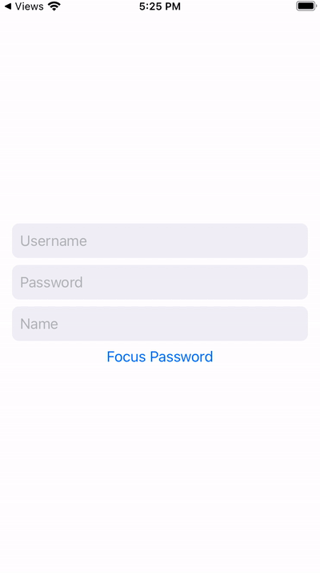

# Focuser

Focuser allows to focus SwiftUI text fields dynamically and implements ability move go through the form using Keyboard for iOS 13 and iOS 14. Implementation is modeled to follow [Apple `@FocusState`](https://developer.apple.com/documentation/swiftui/focusstate) property wrapper however instead of however instead of `@FocusState` we use `@FocusStateLegacy` and for `.focused(...)` we use `.focusedLegacy(...)`. Since most of us cannot update our apps to serve iOS 15 exclusively `Focuser` will provide an easy way to change first responder and connect to keyboard "next"/"done" buttons.

## Preview



## Install

We are going to maintain Focuser and extend its functionality in the near future. You can use Focuser in your project using SPM

`File` > `Swift Packages` > `Add Package Dependency` and use

```
git@github.com:art-technologies/swift-focuser.git
```

## Example

Feel free to download full Xcode example project in `Example` folder.

To use Focuser you first need to `import Focuser` and define an `enum` corresponding to text fields.

```swift
import Focuser

enum FormFields {
    case username, password, name
}
```

Since Focuser allows to focus keyboard to the next text fields using keybaord we have to provide additional information of what the next field should be. We provide this using extension on our struct comforming to `FocusStateCompliant` protocol. In addition of providing computed variable `next` we also provide `last`. This indicates to Focuser when it should show "done" keyboard button instead of "next". To resign first responder (hide keyboard) set your `focusedField` to `nil`.

```swift
extension FormFields: FocusStateCompliant {

    static var last: FormFields {
        .name
    }

    var next: FormFields? {
        switch self {
        case .username:
            return .password
        case .password:
            return .name
        default: return nil
        }
    }
}
```

Finally we can build our form

```swift
struct ContentView: View {
    @FocusStateLegacy var focusedField: FormFields?
    @State var username = ""
    @State var password = ""
    @State var name = ""

    var body: some View {
        VStack{
            TextField("Username", text: $username)
                .focusedLegacy($focusedField, equals: .username)

            TextField("Password", text: $password)
                .focusedLegacy($focusedField, equals: .password)

            TextField("Name", text: $name)
                .focusedLegacy($focusedField, equals: .name)

            Button(action: {
                focusedField = FormFields.password
            }) {
                Text("Focus Password")
            }
        }
        .padding()
    }
}
```

Here we introduced "Focus Password" button showing how to focus a specific text field dynamically.

## Caveats

Make sure to apply `.focusedLegacy` modifier as the last modifier to `TextField`. I will make a fix later on to aleviate the order issue.

```swift
TextField("Username", text: $username)
   .padding(9)
   .background(Color(.systemGray6))
   .cornerRadius(8)
   .focusedLegacy($focusedField, equals: .username)
```

## Comparison to iOS 15 `@FocusState`

The API is analogous and our property wrapper has exactly the same definition. If you ever decide to switch to iOS 15 wrapper, all you need to do is replace

`@FocusStateLegacy` -> `@FocusState`

`.focusedLegacy(...)` -> `.focused(...)`

However, Focuser additionally offers to show different keyboard return button such as "next" or "done" based on where you are in the form.

## To do

- Support for `TextEditor`
